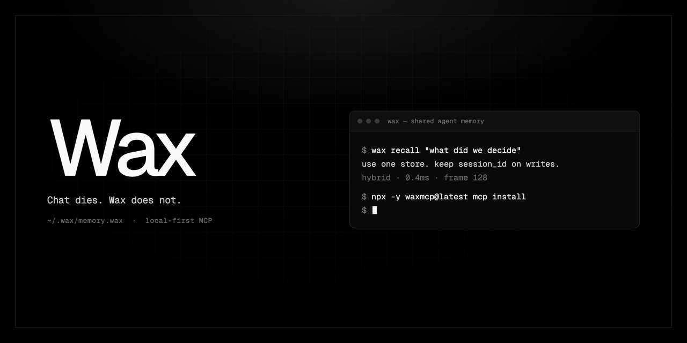
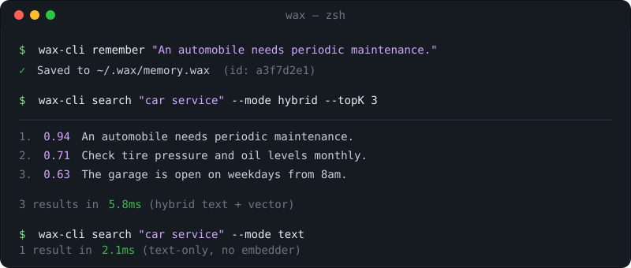
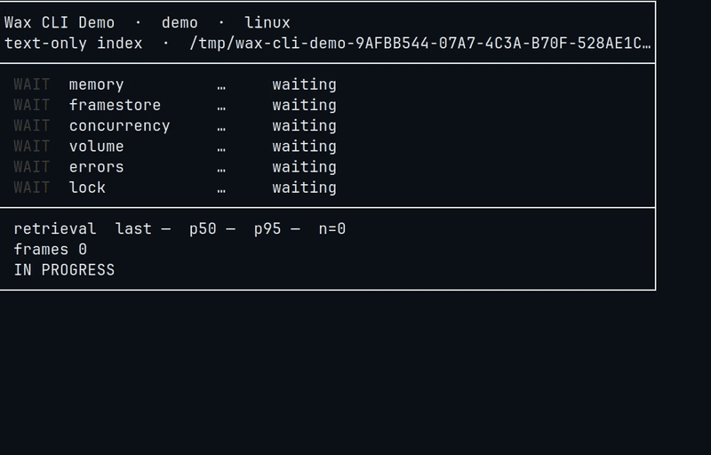

<!-- HEADER:START -->

<div align="center">
  <a href="https://trendshift.io/repositories/21759?utm_source=trendshift-badge&amp;utm_medium=badge&amp;utm_campaign=badge-trendshift-21759" target="_blank" rel="noopener noreferrer"></a>
  
</div>

<div style="height: 16px;"></div>

<p align="center">
  <strong>Single File Memory layer memory for every agent that runs on Apple Silicon </strong><br/>
  One <code>.wax</code> file. Foundation Models, Claude, Cursor, Codex, Hermes — same store.<br/>
  Sync with iCloud, or AirDrop the file.
</p>

<p align="center">
  <a href="https://github.com/christopherkarani/Wax/releases"></a>
  <a href="https://developer.apple.com/ios/"></a>
  <a href="https://github.com/christopherkarani/Wax/blob/main/LICENSE"></a>
  <a href="https://github.com/christopherkarani/Wax/stargazers"></a>
</p>

<p align="center">
  <a href="README.md">English</a> · <a href="Resources/locales/README.es.md">Español</a> · <a href="Resources/locales/README.fr.md">Français</a> · <a href="Resources/locales/README.ja.md">日本語</a> · <a href="Resources/locales/README.ko.md">한국어</a> · <a href="Resources/locales/README.pt.md">Português</a> · <a href="Resources/locales/README.zh-CN.md">中文</a>
</p>
<!-- HEADER:END -->

---

## What is Wax?

Wax is a **local-first shared memory layer**. It allows any AI to have a single file memory engine with access to vector search, photo and video rag, optimized for Apple Silicon

That store is one file: `~/.wax/memory.wax`. No hosted vector DB. Memory, Decisions, facts survive the chat, the app, and the reboot.

**Same Mac, many agents.** For those using multiple different agents, Wax points each host at the file (or at one local HTTP server). They share memory instead of each keeping a private brain.

**Another Mac Or iPhone Device** Put the file in iCloud Drive and both machines see the same store, or AirDrop `memory.wax` like any other document.

```text
~/Library/Mobile Documents/com~apple~CloudDocs/Wax/memory.wax   # iCloud
# or
AirDrop  memory.wax  →  ~/.wax/memory.wax
```

Agent setup: [Agent Quick Start](#agent-quick-start) · host snippets: [wax-mcp-hosts.md](Resources/docs/wax-mcp-hosts.md)

<p align="center">
  
</p>

### Also a Swift engine

The Engine is Swift Native. Embed it in an iOS or macOS app when you want on-device RAG without standing up a server.

```swift
import Wax

let memory = try await Memory(at: url)
try await memory.save("The user prefers dark mode and uses Vim keybindings.")
let results = try await memory.search("What editor does the user like?")
// → "The user prefers dark mode and uses Vim keybindings."
```

<p align="center">
  
</p>

### What you can build

- **Shared agent memory** — one store across every MCP client on the machine.
- **Carry it** — iCloud the file between Macs, or AirDrop it.
- **Personal knowledge** — semantic search over notes and clips, still on disk.
- **On-device RAG** — ship memory inside an app, no cloud dependency.

---

## Choose Your Path

| 🤖 Every agent on this Mac | ⌨️ CLI | 🛠️ Swift app |
|:---------------------------|:-------|:-------------|
| **You want:** Claude, Cursor, Codex, Hermes sharing one local memory. Sync the file with iCloud or AirDrop. | **You want:** A command-line store you can script. | **You want:** The same engine inside an iOS/macOS app. |
| **Get started:** [Agent Quick Start](#agent-quick-start) ↓ | **Get started:** [CLI Quick Start](#cli-quick-start) ↓ | **Get started:** [Swift Quick Start](#swift-quick-start) ↓ |

---

## Swift Quick Start

### 1. Add Wax to your project

**Swift Package Manager**

```swift
// Package.swift
dependencies: [
    .package(url: "https://github.com/christopherkarani/Wax.git", from: "0.2.22")
]
```

Or in Xcode: **File → Add Package Dependencies →** `https://github.com/christopherkarani/Wax.git`

### 2. Copy-paste this into your app

```swift
import Foundation
import Wax

let url = URL.documentsDirectory.appending(path: "agent.wax")

// Open a memory store
let memory = try await Memory(at: url)

// Save something
try await memory.save("The user is building a habit tracker in SwiftUI.")

// Recall it later — works even if the app was killed
let results = try await memory.search("What is the user building?")
if let best = results.items.first {
    print("Found: \(best.text)")
    // → "Found: The user is building a habit tracker in SwiftUI."
}

try await memory.close()
```

<details>
<summary><strong>SwiftUI example</strong></summary>

```swift
import SwiftUI
import Wax

struct ContentView: View {
    @State private var result = "Searching…"

    var body: some View {
        Text(result)
            .task {
                do {
                    let url = URL.documentsDirectory.appending(path: "agent.wax")
                    let memory = try await Memory(at: url)

                    try await memory.save("The user is building a habit tracker in SwiftUI.")
                    let context = try await memory.search("What is the user building?")

                    result = context.items.first?.text ?? "Nothing found"
                    try await memory.close()
                } catch {
                    result = "Error: \(error.localizedDescription)"
                }
            }
    }
}
```

</details>

<details>
<summary><strong>CLI tool (<code>main.swift</code>)</strong></summary>

```swift
import Foundation
import Wax

@main
struct AgentMemory {
    static func main() async throws {
        let url = URL.documentsDirectory.appending(path: "agent.wax")
        let memory = try await Memory(at: url)

        try await memory.save("The user is building a habit tracker in SwiftUI.")

        let results = try await memory.search("What is the user building?")
        if let best = results.items.first {
            print("Found: \(best.text)")
        }

        try await memory.close()
    }
}
```

</details>

Prefer a checked-in harness over pasting snippets? [Run the demo](#run-the-demo) — `Resources/WaxDemo` exercises the public `Memory` APIs on macOS 26.

Looking to store persistent facts and long-term reasoning? Structured memory (entities and facts) is available today through the MCP server tools (`entity_upsert`, `fact_assert`, `facts_query`, …) described in the [Agent Quick Start](#agent-quick-start). The Swift-level structured memory API is package-internal for now; see [Structured Memory](Sources/WaxCore/WaxCore.docc/Articles/StructuredMemory.md) (contributor documentation).

---

## Run the demo

`Resources/WaxDemo` is a small Swift package that stress-tests the public Wax APIs (save/search durability, embeddings, Foundation Models, error paths).

**Requires macOS 26** (the demo package declares that platform; Foundation Models mode needs Apple Intelligence where available).

```bash
cd Resources/WaxDemo
swift run WaxDemo --mode all
```

Useful modes:

| Mode | What it runs |
|:-----|:-------------|
| `memory` | Save → search → close → reopen → search |
| `framestore` | Low-level frame create/put/read/delete |
| `embeddings` | Built-in MiniLM + hybrid/vector search |
| `fm` | Foundation Models memory session (or a clear unavailable message) |
| `errors` | Validation / `WaxError` paths |
| `all` | Everything above (default) |

```bash
swift run WaxDemo --mode memory
swift run WaxDemo --mode fm --keep --store /tmp/wax-demo.wax
```

`--keep` leaves the `.wax` file on disk; `--store PATH` picks the file location.

Source: [`Resources/WaxDemo`](Resources/WaxDemo).

---

## CLI Quick Start

### 1. Install

```bash
# Build from source (requires Swift 6+)
git clone https://github.com/christopherkarani/Wax.git
cd Wax
swift build -c release

# The binary is now at .build/release/wax-cli
cp .build/release/wax-cli /usr/local/bin/
```

### 2. Remember and recall from the terminal

```bash
# Save a memory
wax-cli remember "An automobile needs periodic maintenance."

# Search it back
wax-cli search "car service" --mode hybrid --topK 3

# Simple text-only search (no setup required)
wax-cli search "car service" --mode text

# Linux / cloud TUI demo + public-API stress (text-only; no MiniLM claim)
wax-cli demo --run
wax-cli demo --stress --run
```

The dashboard tracks **retrieval time** live (`last` / `p50` / `p95` / `n`) on every successful `Memory.search`.

On Linux, build `wax-cli` **without** `-DGRDBCUSTOMSQLITE` (that flag breaks GRDB's system SQLite overlay):

```bash
swift build --product wax-cli --traits default,MCPServer
BIN="$(swift build --product wax-cli --show-bin-path --traits default,MCPServer)/wax-cli"
"$BIN" demo --run
"$BIN" demo --stress --run
# Hold each TUI frame for a recording or live walkthrough
"$BIN" demo --run --pace-ms 1500 --hold-ms 4000
```

For long-running sessions, start the daemon:

```bash
wax-cli daemon --store-path ~/.wax/memory.wax
```

Then send JSON-line commands:

```json
{"id":"1","command":"remember","content":"An automobile needs periodic maintenance."}
{"id":"2","command":"search","query":"car service","mode":"hybrid","topK":3}
{"id":"3","command":"shutdown"}
```

> [!NOTE]
> Vector search requires the embedder. If it's unavailable, hybrid/vector commands fail loudly instead of silently falling back to text-only mode.

### Repair a store safely

The offline maintenance commands always require an explicit source, destination,
and direct-file opt-in. They take a locked, byte-verified copy of the source,
perform the work in a staging file, deep-verify it, and atomically publish the
destination. The source is not modified. A destination that already exists must
be a regular, unlocked file and requires `--overwrite`; symlink and live-store
aliases are rejected.

```bash
# Compact a degraded or legacy store without touching the source.
wax-cli compact-store \
  --direct-store \
  --no-embedder \
  --store-path /path/to/source.wax \
  --output /path/to/compacted.wax

# Backfill missing vectors on a verified copy (requires an embedder build).
wax-cli embed-backfill \
  --direct-store \
  --store-path /path/to/source.wax \
  --output /path/to/backfilled.wax
```

Use `--overwrite` only when replacing an existing destination is intentional.
Do not point either command at `~/.wax/memory.wax` or another broker-managed
live-store path; stop attached writers first and use `--format json` when the
result is consumed by automation. The commands report `sourceUnchanged` and
`deepVerified` on successful JSON output.

---

## Agent Quick Start

Give your AI coding assistant (Claude Code, Cursor, Codex, Hermes, OpenClaw, Windsurf) a persistent memory that survives across sessions.

Installing the server is not enough. Hosts ignore MCP tool descriptions unless an always-on file says **when** to write. Paste a block below after you wire the host.

### 1. Stage the server once

```bash
npx -y waxmcp@latest install
```

**Claude-only** can use stdio. **Two or more clients must share one HTTP server** on `http://127.0.0.1:3000/mcp` — a second process on `~/.wax/memory.wax` will lock.

<details>
<summary><strong>Host wire-up (Claude, Codex, Cursor, Hermes, OpenClaw)</strong></summary>

| Host | Wire-up |
|------|---------|
| Claude Code | `swift run --traits MCPServer wax-cli mcp install --scope user` then `claude install-skill ~/.local/share/waxmcp/skills/wax-mcp` |
| Codex | `[mcp_servers.wax] url = "http://127.0.0.1:3000/mcp"` in `~/.codex/config.toml` + copy the skill to `~/.codex/skills/wax-mcp` |
| Cursor | `{ "mcpServers": { "wax": { "url": "http://127.0.0.1:3000/mcp" } } }` in `~/.cursor/mcp.json` + paste the AGENTS.md block |
| Hermes | HTTP + `memory.provider: wax-memory` + paste the SOUL.md stanza into `~/.hermes/SOUL.md` (or `$HERMES_HOME/SOUL.md`); replace an existing `## Memory (Wax)` section |
| OpenClaw | HTTP + memory plugin + paste the SOUL.md stanza into the workspace `SOUL.md`; replace an existing `## Memory (Wax)` section |
| Anything else | HTTP URL + paste the AGENTS.md block into project `AGENTS.md` |

Full snippets, the HTTP start command, and a smoke test: [Resources/docs/wax-mcp-hosts.md](Resources/docs/wax-mcp-hosts.md).

The **wax-mcp** skill is the operator playbook. The **wax** skill is Swift framework integration — different audience.

</details>

### 2. Teach the model when to use Wax

Pick the file your host actually loads on every turn.

<details>
<summary><strong>Paste into AGENTS.md / CLAUDE.md / Cursor rules</strong></summary>

Use the project or user `AGENTS.md`, `CLAUDE.md`, or `.cursor/rules`. Same text as `Resources/skills/public/wax-mcp/references/project-rules.md`.

```text
Wax is shared memory. Chat dies; Wax does not.

Learn. Write the moment it would change the next agent's behavior — including a one-line correction or preference:
- user_preference — how this person works, who they are, standing corrections
- lesson — we got burned; do not do that again
- fact — a true thing about this repo or product the next agent needs
- decision / constraint — a choice that should bind later work

Skip only empty chit-chat. Store one or two sentences. Do not store chats, test logs, plan drafts, or secrets.

Open: call `session_open` (`project` = repo, stable `agent_id` / `run_id`). Keep `session_id`. Do not invent one. Same `agent_id`+`run_id` resumes. Same `agent_id`+project rebinds if exactly one live session exists. If more than one is live, open a new session — do not guess.

Before the first answer:
1. `recall` with `session_id`, `mode: text`, query = this job
2. `recall` with `session_id`, `scope: global`, `mode: text`, query = facts about this person / standing corrections
Empty project recall is a miss, not "I have no memory."

Lasting writes: `remember` with top-level `session_id` and `memory_type` `lesson` | `user_preference` | `fact` | `decision` | `constraint`. Do not pass `scope: durable`. Type keeps them durable and stamps the project so default recall can find them. Person-facts still pass `session_id`; read them later with `scope: global`. Never put `session_id` in `metadata`.

This job only (not the default write): `remember` with `session_id`, `memory_type: task_state`, `durability: working` — plan lock, failed path, landmine, before you spawn or stop. Parent writes before spawning; children often have no Wax tools.

Close when the job ends, not between turns: `session_close` with `session_id`, a short state `content`, and `pending_tasks` for unfinished work. If a call returns inactive / `resumable: false`, call `session_open` again. Follow the MCP server instructions when present.
```

</details>

<details>
<summary><strong>Paste into Hermes / OpenClaw SOUL.md</strong></summary>

Hermes: `~/.hermes/SOUL.md` or `$HERMES_HOME/SOUL.md`. OpenClaw: the workspace `SOUL.md`.

SOUL.md is identity. **Append** this section if missing. If `## Memory (Wax)` already exists, **replace that section**. Do not replace the rest of the soul.

```text
## Memory (Wax)

You have Wax. Chat is not memory. Learn this person and keep it.

Write the moment it would change how you treat them or the work — including a one-line correction:
- user_preference — how they work, who they are, standing corrections
- lesson — we got burned
- fact — something true that should stick
- decision / constraint — a choice that should bind later work

Store one or two sentences. Do not store chats, status, or secrets.

On every real job: call `session_open` (`project` = the repo you are in, `agent_id` = your name, `run_id` = this conversation). Keep `session_id`. Do not invent one. Do not open per message. Do not close between turns.

Before you act:
1. `recall` with `session_id`, `mode: text`, query = this repo/job
2. `recall` with `session_id`, `scope: global`, `mode: text`, query = facts about this person

Lasting writes: `remember` with top-level `session_id` and `memory_type` `user_preference` | `lesson` | `fact` | `decision` | `constraint`. Do not pass `scope: durable`.

This job only: `remember` with `session_id`, `memory_type: task_state`, `durability: working`.

Close with `session_close` (`session_id`, short `content`, `pending_tasks`) when the job ends. If a call returns inactive / `resumable: false`, call `session_open` again. Follow the MCP server instructions when present.
```

</details>

<details>
<summary><strong>Grokbot (xAI) — paste this into your Bot after wiring the server</strong></summary>

Grokbot runs locally on your Mac, so Wax serves it over loopback — no tunnel, no cloud copy of your memory.

One-time setup:

```bash
# 1. Stage Wax
npx -y waxmcp@latest install

# 2. Start the server and keep it running (add to your shell profile / login items)
~/.local/share/waxmcp/bin/start-wax-mcp-http.sh
```

Then in Grokbot: **Settings → Plugins → Add MCP server**

| Field | Value |
|-------|-------|
| Name | `wax` |
| URL | `http://127.0.0.1:3000/mcp` |

Finally, paste this prompt into your **main (coordinator) bot** — it sets up its own memory and rolls Wax out to every bot on the team:

```text
You have a memory tool server called "wax". Use it as your primary memory, and make it the primary memory for every bot on our team.

Your own memory:
- Starting any multi-step job: call session_open (project set to my name, stable agent_id/run_id), keep the returned session_id, then recall with mode text before you act. Also recall scope global for facts about me.
- While working: write lessons, user_preference, and facts with session_id the moment they show up (including a one-line correction). Do not pass scope durable. task_state is only for this job (plan, failed path, landmine).
- Finishing: session_close with a short summary and pending_tasks so your next session resumes cleanly.
- Never store passwords, tokens, or secrets. If the wax tools are missing, stop and tell me instead of improvising.

Roll out to the team:
1. List every bot we already have. For each one, add the "Your own memory" rules above to its persistent instructions/memory, then verify it can see the wax tools (have it run the wax stats tool) and report back which bots succeeded and which failed.
2. From now on, whenever you spawn a new bot, include those same rules in its starting instructions before it begins any work.
3. Save this whole policy in wax as memory_type user_preference with session_id so you keep enforcing it across sessions.
```

Wax stays 100% local: the `.wax` file never leaves your machine, and the loopback bind is unreachable from outside. Full host playbook: [Resources/docs/wax-mcp-hosts.md](Resources/docs/wax-mcp-hosts.md).

</details>

Host install path: [Resources/docs/wax-mcp-hosts.md](Resources/docs/wax-mcp-hosts.md). Claude/doctor details: [Resources/docs/wax-mcp-setup.md](Resources/docs/wax-mcp-setup.md).

---

## Why Wax?

| Feature          | Wax                    | SQLite (FTS5)          | Cloud Vector DBs       |
|:-----------------|:-----------------------|:-----------------------|:-----------------------|
| **Search**       | Hybrid (Text + Vector) | Text Only*             | Vector Only*           |
| **Latency**      | **~6ms (p95)**         | ~10ms (p95)            | 150ms - 500ms+         |
| **Privacy**      | 100% Local             | 100% Local             | Cloud-hosted           |
| **Setup**        | Zero Config¹           | Low                    | Complex (API Keys)     |
| **Architecture** | Apple Silicon Native   | Generic                | Varies                 |

¹ Text search works out of the box everywhere. Semantic (vector) search auto-configures the on-device MiniLM embedder on iOS 18/macOS 15+; on older OS versions, pass a custom `EmbeddingProvider` or search text-only. `results.diagnostics` and `memory.stats()` always report which retrieval mode actually ran — Wax never silently pretends a text-only result is semantic.

### Why a single `.wax` file?

Most RAG setups end up with a database, a vector store, and a file server. Wax keeps the moving pieces smaller by bundling documents, metadata, and indexes into one binary.

- **Less setup** — no Docker stack and no separate database to babysit.
- **Portable** — move the file with AirDrop, iCloud, or whatever sync layer you already use.
- **Atomic** — backup, copy, or delete one file instead of chasing state across services.

---

## Performance

Wax is tuned for M-series hardware and local recall.

### Recall Latency (p95)

*Lower is better. Measured in milliseconds.*

```text
Wax (Hybrid)  |██ 6.1ms
SQLite (Text) |████ 12ms
Cloud RAG     |██████████████████████████████████████████████████ 150ms+
```

### Cold Open Time (p95)

*Lower is better. Measured in milliseconds.*

```text
Wax           |███ 9.2ms
Traditional   |██████████████████████████████████████ 120ms+
```

> Cold open measures store open only. The built-in embedder's first-ever CoreML compile is a separate one-time cost; later launches reuse the cached compiled model.

> [!TIP]
> **Ingest Throughput:** Wax handles **85.9 docs/s** with full hybrid indexing on an M3 Max.
> Full benchmark report: [Resources/docs/benchmarks/2026-03-06-performance-results.md](Resources/docs/benchmarks/2026-03-06-performance-results.md)

---

## Architecture

<details>
<summary><strong>How Wax works under the hood (click to expand)</strong></summary>

Wax uses a frame-based container format and embeds the search engines it needs inside the main file: SQLite FTS5 for text and a Metal-accelerated HNSW index for vectors. The Metal HNSW engine activates automatically once an index holds 10,000+ vectors; smaller indexes use an exact Accelerate/CPU flat index with identical recall.

### Internal File Layout

```text
┌──────────────────────────────────────────────────────────────────────────┐
│                          Dual Header Pages (A/B)                         │
│   (Magic, Version, Generation, Pointers to WAL & TOC, Checksums)         │
├──────────────────────────────────────────────────────────────────────────┤
│                          WAL (Write-Ahead Log)                           │
│   (Atomic ring buffer for crash-resilient uncommitted mutations)         │
├──────────────────────────────────────────────────────────────────────────┤
│                          Compressed Data Frames                          │
│   ┌──────────────────┐  ┌──────────────────┐  ┌──────────────────┐       │
│   │ Frame 0 (LZ4)    │  │ Frame 1 (LZ4)    │  │ Frame 2 (LZ4)    │ ...   │
│   │ [Raw Document]   │  │ [Metadata/JSON]  │  │ [System Info]    │       │
│   └──────────────────┘  └──────────────────┘  └──────────────────┘       │
├──────────────────────────────────────────────────────────────────────────┤
│                          Hybrid Search Indices                           │
│   ┌──────────────────────────────┐  ┌──────────────────────────────┐     │
│   │ SQLite FTS5 Blob             │  │ Metal HNSW Index             │     │
│   │ (Text Search + EAV Facts)    │  │ (Vector Search)              │     │
│   └──────────────────────────────┘  └──────────────────────────────┘     │
├──────────────────────────────────────────────────────────────────────────┤
│                          TOC (Table of Contents)                         │
│   (Index of all frames, parent-child relations, and engine manifests)    │
└──────────────────────────────────────────────────────────────────────────┘
```

1. **Atomic resilience:** dual headers and the WAL keep the store consistent even if the process dies mid-write.
2. **Unified retrieval:** one query fans out to both the BM25 text index and the HNSW vector index.
3. **Structured knowledge:** built-in EAV (Entity-Attribute-Value) storage handles durable facts and long-term reasoning. (Exposed today via the MCP server tools; the Swift-level API is package-internal.)

</details>

---

## Ecosystem Tools

### 🤖 MCP Server

Wax provides a first-class **Model Context Protocol (MCP)** server. Connect your local memory to Claude Code or any MCP-compatible agent.

```bash
npx -y waxmcp@latest install
```

Then [wire the host](#agent-quick-start) and paste the AGENTS.md or SOUL.md block so the model actually writes. Snippets: [wax-mcp-hosts.md](Resources/docs/wax-mcp-hosts.md).

<details>
<summary><strong>HTTP, OpenClaw, and Markdown extras</strong></summary>

Claude registrar and doctor: [Resources/docs/wax-mcp-setup.md](Resources/docs/wax-mcp-setup.md).

OpenClaw adapter check: [`scripts/verify-openclaw-adapter.sh`](scripts/verify-openclaw-adapter.sh). Native-memory operator guide: [docs/openclaw-native-memory.md](docs/openclaw-native-memory.md).

The MCP surface supports `markdown_export` / `markdown_sync` (`MEMORY.md`, daily notes, `DREAMS.md`). `markdown_sync` accepts `dry_run`. Promotion thresholds can be overridden on `session_synthesize` / `memory_promote`.

Local HTTP (when this process is the only writer):

```bash
./.build/debug/wax-mcp --no-embedder --transport http --http-host 127.0.0.1 --http-port 3000
```

</details>

### 🔍 WaxRepo

A semantic search TUI for your git history. Index any repository and find code or commits using natural language.

```bash
# From within any git repo
wax-repo index
wax-repo search "where did we implement the WAL?"
```

---

## FAQ

**Q: Do I need an internet connection?**  
A: No. Wax is 100% on-device. No cloud APIs, no network calls.

**Q: How big does the `.wax` file get?**  
A: It depends on your data, but the file stays compact thanks to LZ4 compression. Typical usage: a few MB for thousands of documents.

**Q: Can I sync the `.wax` file across devices?**  
A: Yes. It's a single file. iCloud Drive, Dropbox, AirDrop — whatever you already use.

**Q: What happens if the app crashes during a write?**  
A: Wax uses a write-ahead log (WAL) and dual headers. The store recovers automatically on the next open.

**Q: Does Wax work on Intel Macs?**  
A: Wax is optimized for Apple Silicon (M-series). It may run on Intel via Rosetta but vector acceleration requires Metal performance shaders best supported on Apple Silicon.

**Q: I get "embedder unavailable" when using hybrid search.**  
A: Hybrid and vector search require a local embedding model. In Swift, `Memory(at:)` auto-configures the built-in MiniLM embedder on iOS 18/macOS 15+ (default `MiniLMEmbeddings` trait), or you can select any custom `EmbeddingProvider` via `Memory.Config.embedding = .custom(...)`. On older OS versions, use text-only search or provide a custom embedder. The CLI/MCP server fail loudly when the embedder is unavailable; the Swift SDK reports the effective retrieval mode via `results.diagnostics` and `memory.stats()`.

---

## Community & Support

- 💬 **Questions & bug reports:** [GitHub Issues](https://github.com/christopherkarani/Wax/issues)
- ⭐ **Star the repo** to follow releases
- 📖 **Full documentation:** [iOS developer docs](https://christopherkarani.github.io/Wax/) · [DocC sources](Sources/Wax/Wax.docc)

---

## License

Wax is released under the Apache License 2.0. See [LICENSE](LICENSE) for details.

<div align="center">
<sub>Built for developers who believe user data belongs on the user's device</sub>
</div>
